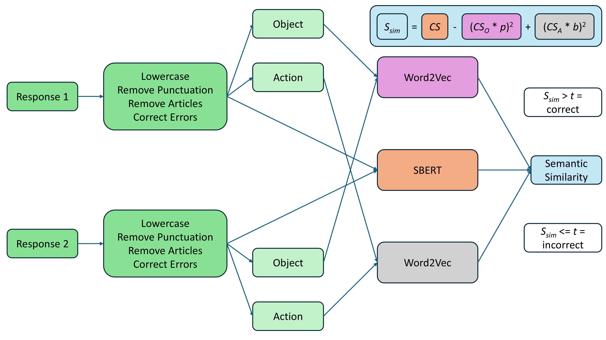

# Seeing Just Enough: The Minimal Visual Ingredients of Egocentric Action Recognition

This repository accompanies the study **“Seeing Just Enough: The Minimal Visual Ingredients of Egocentric Action Recognition”**, investigating the spatial and temporal features that make everyday actions recognisable from first-person (egocentric) video.

---

## 📘 Overview

Humans can recognise complex actions from very limited visual information — sometimes just a few frames or small image regions.
In this project, we identify **the minimal visual features** required for recognising actions in naturalistic egocentric videos from the [EPIC-Kitchens-100 dataset](https://epic-kitchens.github.io/).

Two main experiments were conducted:

1. **Experiment 1 – Human Ground Truth (HGT):**  
   Participants labelled short egocentric videos of everyday actions (e.g., *opening fridge*, *putting down cup*).  
   A custom **language-model framework (SBERT + Word2Vec)** quantified the semantic consistency of responses to derive robust *Human Ground Truth* labels.

2. **Experiment 2 – Iterative Reduction:**  
   Consistently recognised videos were recursively **cropped** and **temporally scrambled** to identify the *Minimal Recognisable Configurations* (MIRCs) and the spatiotemporal features whose removal causes recognition breakdown.  
   Recognition was modelled using **linear mixed-effects models** and **random-forest feature classifiers** (with SHAP and Boruta analysis) on both high-level (hands, objects) and low/mid-level (orientation, motion, colour, etc.) visual features.

---

## 🧠 Key Findings

- Recognition breaks down abruptly once critical **hand–object and orientation features** are removed.  
- *Easy* and *Hard* videos (based on network action classifier accuracy) differ not only in recognisability by humans but in the **relative weight of spatial and spatiotemporal features**.  
- MIRCs typically occupied **~3–5 %** of the original visual scene, yet preserved enough information for accurate recognition.

---

### SBERT Framework Used for Computing Semantic Similarity Between Responses



---

### Spatial and Temporal Reduction Process


---

## 📂 Repository Structure

```text
📁 Human Ground Truth/
├─ 📁 demos/
├─ "SBERT_framework_response-response.py" - script used to quantify pair-wise Semantic Similarities between responses using SBERT
├
├─ 📁 example_video_responses/
├─ "10788.csv" - example file with responses to video 10788, the "SBERT_framework_response-response.py" script can be applied to this file to construct the semantic space of responses
├
└─ "HGT_master.xlsx" - Human Ground Truth, Recognition Consistency and other descriptive statistics for each video


📁 Reduction Experiment/
├─ 📁 binary_classification_sets_and_results/ - sets used for classification + classification results of each comparison
├
├─ 📁 demos/
├─ "loo_randomforest_classification_and_shap.py" - base script used for classification and SHAP (can be ran on provided classification sets)
├─ "loo_randomforest_boruta_bootstrap.py" - script used to produce the Boruta threshold and assess the significance of SHAP feature importance (can be ran on provided classification sets)
├─ "SBERT_framework_response-GT.py" - script used to compute Semantic Similarities between responses and Ground Truths
├
├─ 📁 example_video_responses/
├─ "pooled_LL_LL_LL_03159.csv" - example file with responses to quadrant LL_LL_LL_03159, the "SBERT_framework_response-GT.py" script can be applied to this file to compute semantic similarities between HGT and responses
├
├─ 📁 segmentation_masks/ - .mp4 files with segmentations, colour coding spreadhseet and reasoning for segmented objects
├
└─ "main_reduction_master.xlsx" - results of participant testing in Experiment 2 for each quadrant and various descriptive statistics

```
---

## 📦 Human Ground Truth Videos
The full database of videos used in Experiment 1 of this project is available at:
[Download from OSF](https://osf.io/cxnm8)

---

## 📦 Epic-ReduAct
The full database of videos, cropped quadrants, and MIRCs used in Experiment 2 of this project is available in the companion repository:  
[**SadeghRahmaniB/Epic-ReduAct**](https://github.com/SadeghRahmaniB/Epic-ReduAct)

These files can be directly mapped to corresponding analyses and metadata in this repository.

---

## 🔍 Dependencies

- **Python 3.11+**  
  `pandas`, `numpy`, `sentence-transformers`, `gensim`, `scikit-learn`, `shap`, `matplotlib`, `seaborn`, `openpyxl`, `joblib`, `spacy`, `scipy`

---

## ⚙️ Running the Analysis Demos

1. Clone this repository  
   ```bash
   git clone https://github.com/filip1O/seeing-just-enough.git
   cd seeing-just-enough
   
2. Create a Python environment and install requirements:
    ```bash
    pip install -r requirements.txt

3. Run feature extraction and classification pipelines

---

## 📊 Citation

If you use these materials or build on this work, please cite:

Rybansky, F. (2025). Seeing Just Enough: The Minimal Visual Ingredients of Egocentric Action Recognition.

---

## 📜 License

All code is released under the MIT License.
Stimuli and derived data (cropped EPIC-Kitchens-100 videos) are shared under Creative Commons BY-NC 4.0, in accordance with the original dataset license.

---

## 🧩 Contact

For questions or collaboration:
Filip Rybansky
Newcastle University, Biosciences Institute
📧 f.rybansky2@newcastle.ac.uk
