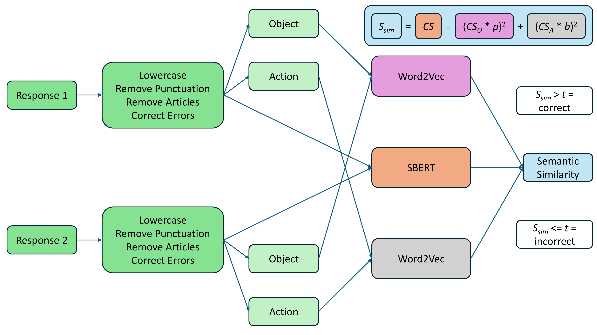
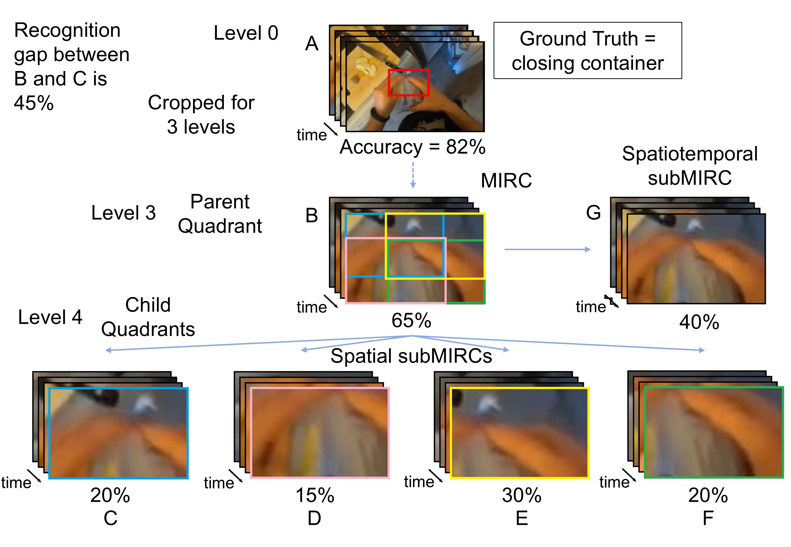

# Seeing Just Enough: The Contribution of Hands, Objects and Visual Features to Egocentric Action Recognition

This repository accompanies the study **“Seeing Just Enough: The Contribution of Hands, Objects and Visual Features to Egocentric Action Recognition”**, investigating the spatial and temporal features that make everyday actions recognisable from first-person (egocentric) video.

---

## 📘 Overview

Humans can recognise complex actions from very limited visual information — sometimes just a few frames or small image regions.
In this project, we identify **the minimal visual features** required for recognising actions in naturalistic egocentric videos from the [EPIC-Kitchens-100 dataset](https://epic-kitchens.github.io/).

1. **Experiment 1 – Human Ground Truth (HGT):**  
   Participants labelled short egocentric videos of everyday actions (e.g., *opening fridge*, *putting down cup*).  
   A custom **language-model framework (SBERT + Word2Vec)** quantified the semantic consistency of responses to derive robust *Human Ground Truth* labels.

2. **Experiment 2 – Iterative Reduction:**  
   Consistently recognised videos were recursively **cropped** and **temporally scrambled** to identify the *Minimal Recognisable Configurations* (MIRCs) and the spatiotemporal features whose removal causes recognition breakdown.  
   Recognition was modelled using **linear mixed-effects models** and **random-forest feature classifiers** (with SHAP and Boruta analysis) on both high-level (hands, objects) and low/mid-level (orientation, motion, colour, etc.) visual features.

3. **Eye tracking:** gaze was recorded while participants viewed Full videos or their MIRCs. Residual normalised scanpath saliency (rNSS) quantified how strongly object regions and GBVS feature maps predicted fixation location after removing image-centre bias.

---

## 🧠 Key Findings

- Recognition breaks down abruptly once critical **hand–object and orientation features** are removed.  
- *Easy* and *Hard* videos (based on network action classifier accuracy) differ not only in recognisability by humans but in the **relative weight of spatial and spatiotemporal features**.  
- MIRCs typically occupied **~3–5 %** of the original visual scene, yet preserved enough information for accurate recognition.
- The eye-tracking experiment confirmed Active Object and Orientation as the strongest fixation predictors.
- Humans may use **adaptive sampling** to recognise actions hard-to-recognise for AI.

---

### SBERT Framework Used for Computing Semantic Similarity Between Responses



---

### Spatial and Temporal Reduction Process



---

## 📂 Repository Structure

```text
📁 Human Ground Truth/
├─ 📁 demos/
├─ "SBERT_framework_response-response.py" - script used to quantify pair-wise Semantic Similarities between responses using SBERT
├
├─ 📁 example_video_responses/
├─ "10788.csv" - example file with responses to video 10788, the "SBERT_framework_response-response.py" script can be applied to this file to construct the semantic space of responses
├
└─ "HGT_master.xlsx" - Human Ground Truth, Recognition Consistency and other descriptive statistics for each video


📁 Reduction Experiment/
├─ 📁 binary_classification_sets_and_results/ - sets used for classification + classification results of each comparison
├
├─ 📁 demos/
├─ "loo_randomforest_classification_and_shap.py" - base script used for classification and SHAP (can be ran on provided classification sets)
├─ "loo_randomforest_boruta_bootstrap.py" - script used to produce the Boruta threshold and assess the significance of SHAP feature importance (can be ran on provided classification sets)
├─ "SBERT_framework_response-GT.py" - script used to compute Semantic Similarities between responses and Ground Truths
├
├─ 📁 example_video_responses/
├─ "pooled_LL_LL_LL_03159.csv" - example file with responses to quadrant LL_LL_LL_03159, the "SBERT_framework_response-GT.py" script can be applied to this file to compute semantic similarities between HGT and responses
├
├─ 📁 segmentation_masks/ - .mp4 files with segmentations, colour coding spreadhseet and reasoning for segmented objects
├
└─ "main_reduction_master.xlsx" - results of participant testing in Experiment 2 for each quadrant and various descriptive statistics

```
---

## 📦 Human Ground Truth Videos and Epic-ReduAct
The full database of videos used in this project is available at:
[OSF](https://osf.io/kbsjy) and [SadeghRahmaniB/Epic-ReduAct](https://github.com/SadeghRahmaniB/Epic-ReduAct)

These files can be directly mapped to corresponding analyses and metadata in this repository.

---

## 🔍 Dependencies

- **Python 3.11+**  
  `pandas`, `numpy`, `sentence-transformers`, `gensim`, `scikit-learn`, `shap`, `matplotlib`, `seaborn`, `openpyxl`, `joblib`, `spacy`, `scipy`, `pydantic`

---

## ⚙️ Running the Analysis Demos

1️⃣ Download the Demo Script and Associated Datafile

The script performs analysis on the associated data. The online location of the datafile associated with each script is encoded in the respective script as 'input_path'.

2️⃣ Install Required Python Packages

Manually or by running in Shell (Windows) / Terminal (Mac) (must have Git installed):
``` bash
git clone https://github.com/filip1O/Seeing-Just-Enough-The-Minimal-Visual-Ingredients-of-Egocentric-Action-Recognition.git
cd "Seeing-Just-Enough-The-Minimal-Visual-Ingredients-of-Egocentric-Action-Recognition"
python -m pip install --upgrade pip setuptools wheel
pip install -r requirements.txt
```

3️⃣ Set Input and Output Filepaths

Replace the input and output path specifications in the downloaded script with your desired local directories.


4️⃣ Run The Demo Script in a Python interpreter

There are 6 demo scripts. HGT Demo Scripts in "Human Ground Truth/demos", Reduction Experiment Demo Scripts in "Reduction Experiment/demos" and Eye-tracking Demo Scripts in "Eye Tracking/demos".

---

## 📊 Citation

If you use these materials or build on this work, please cite:

```bash
@article {Rybansky2026.02.15.705896,
	author = {Rybansky, Filip and Rahmaniboldaji, Sadegh and Gilbert, Andrew and Guerin, Frank and Hurlbert, Anya C. and Vuong, Quoc C.},
	title = {Seeing Just Enough: The Contribution of Hands, Objects and Visual Features to Egocentric Action Recognition},
	elocation-id = {2026.02.15.705896},
	year = {2026},
	doi = {10.64898/2026.02.15.705896},
	publisher = {Cold Spring Harbor Laboratory},
	URL = {https://www.biorxiv.org/content/early/2026/02/17/2026.02.15.705896},
	journal = {bioRxiv}
}

```

---

## 📜 License

All code is released under the MIT License.
Stimuli and derived data (cropped EPIC-Kitchens-100 videos) are shared under Creative Commons BY-NC 4.0, in accordance with the original dataset license.

---

## 🧩 Contact

For questions or collaboration:
Filip Rybansky
Newcastle University, Biosciences Institute
📧 f.rybansky2@newcastle.ac.uk

---

## 💰 Acknowledgements

Leverhulme Trust Research Project Grant RPG-2023-079 funded this work.
